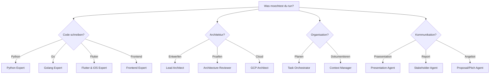

# Agent-Katalog

Der Copilot Expert Hub umfasst **15 spezialisierte AI-Agents**, organisiert in vier Kategorien.

---

## Kategorien

### :material-wrench: Engineering
**8 Agents** fuer Softwareentwicklung, Architektur und Cloud

- [Lead Architect](lead-architect.md) — Systemarchitektur & ADRs
- [Python Expert](python-expert.md) — Idiomatic Python, Patterns
- [Golang Expert](golang-expert.md) — Production-Grade Go
- [Flutter & iOS Expert](flutter-ios-expert.md) — Mobile mit Dart/Flutter
- [Frontend Expert](frontend-expert.md) — Vue.js, Angular, TypeScript
- [GCP Architect](gcp-architect.md) — Google Cloud Loesungen
- [Test Strategist](test-strategist.md) — Teststrategien & QA
- [DevOps Agent](devops-agent.md) — CI/CD & Automation

### :material-magnify: Review & Qualitaet
**2 Agents** fuer Code- und Architektur-Reviews

- [Architecture Reviewer](architecture-reviewer.md) — Architektur-Bewertung
- [Code Reviewer](code-reviewer.md) — Code-Qualitaet & Best Practices

### :material-cog: Produktivitaet
**2 Agents** fuer Projektkoordination und Wissensmanagement

- [Task Orchestrator](task-orchestrator.md) — Aufgabenplanung & Tracking
- [Context Manager](context-manager.md) — Projektgedaechtnis & Kontext

### :material-account-group: Kunden & Kommunikation
**3 Agents** fuer Praesentationen, Reports und Proposals

- [Presentation Agent](presentation-agent.md) — Marp Slide Decks
- [Stakeholder Agent](stakeholder-agent.md) — Business-Kommunikation
- [Proposal/Pitch Agent](proposal-pitch.md) — Projektangebote & Roadmaps

---

## Schnellreferenz

| Agent | Kategorie | Kernkompetenz | Typischer Einsatz |
|-------|-----------|---------------|-------------------|
| Lead Architect | Engineering | Systemdesign, DDD, ADRs | Architekturentwurf neuer Systeme |
| Python Expert | Engineering | Python 3.12+, SOLID, Patterns | Backend-Services, Refactoring |
| Golang Expert | Engineering | Go 1.22+, Concurrency | Microservices, CLIs |
| Flutter & iOS Expert | Engineering | Dart/Flutter, BLoC, Clean Arch | Mobile Apps |
| Frontend Expert | Engineering | TypeScript, Vue, Angular | Web-Frontends, SPAs |
| GCP Architect | Engineering | Serverless, Terraform, Pub/Sub | Cloud-Infrastruktur |
| Test Strategist | Engineering | Test Pyramid, TDD | Teststrategien, Quality Gates |
| DevOps Agent | Engineering | GitHub Actions, GitOps | CI/CD Pipelines |
| Architecture Reviewer | Review | Architektur-Bewertung | Risikoanalyse, Anti-Patterns |
| Code Reviewer | Review | Code-Qualitaet | PR Reviews, Bug Detection |
| Task Orchestrator | Produktivitaet | Aufgabenzerlegung | Projektplanung |
| Context Manager | Produktivitaet | Wissensmanagement | Dokumentation, ADR-Tracking |
| Presentation Agent | Kommunikation | Marp Slides | Client Pitches, Tech Talks |
| Stakeholder Agent | Kommunikation | Business-Sprache | Status Reports, Summaries |
| Proposal/Pitch Agent | Kommunikation | Proposals, Roadmaps | Angebotserstellung |

---

## Agent auswaehlen

