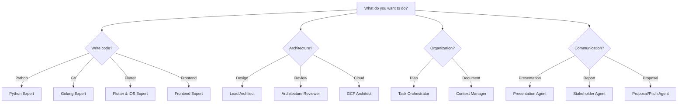

# Agent Catalog

The Copilot Expert Hub includes **15 specialized AI agents**, organized by the phases of the Software Delivery Lifecycle.

---

## The Agent Lifecycle

```mermaid
graph LR
    A["🎯 Planning"] --> B["💻 Implementation"]
    B --> C["🧪 Quality"]
    C --> D["🚀 Deployment"]
    D --> E["📊 Communication"]

    style A fill:#e8eaf6,stroke:#3949ab
    style B fill:#e3f2fd,stroke:#1565c0
    style C fill:#e8f5e9,stroke:#2e7d32
    style D fill:#f3e5f5,stroke:#6a1b9a
    style E fill:#fce4ec,stroke:#c62828
```

---

## :material-target: Phase 1 — Planning & Architecture

### :material-floor-plan: Lead Architect
Planning

System architecture, ADRs, DDD, Event Sourcing, C4 diagrams. Designs scalable and maintainable systems.

[:material-arrow-right: Details](lead-architect.md)

### :material-clipboard-list: Task Orchestrator
Planning

Breaks projects into epics and tasks, coordinates agent workflows, and tracks progress.

[:material-arrow-right: Details](task-orchestrator.md)

### :material-cloud: GCP Architect
Planning

Google Cloud Platform solutions: Cloud Run, Pub/Sub, BigQuery, Terraform, IAM.

[:material-arrow-right: Details](gcp-architect.md)

---

## :material-code-braces: Phase 2 — Implementation

### :material-language-python: Python Expert
Code

Idiomatic Python 3.12+, Pydantic, async/await, Repository Pattern, SOLID.

[:material-arrow-right: Details](python-expert.md)

### :material-language-go: Golang Expert
Code

Production-grade Go: Interfaces, Concurrency, Error Handling, Clean Architecture.

[:material-arrow-right: Details](golang-expert.md)

### :material-cellphone: Flutter & iOS Expert
Code

Dart/Flutter, BLoC, Riverpod, Clean Architecture, iOS Human Interface Guidelines.

[:material-arrow-right: Details](flutter-ios-expert.md)

### :material-language-typescript: Frontend Expert
Code

TypeScript, Vue.js, Angular, Component Patterns, State Management, Testing.

[:material-arrow-right: Details](frontend-expert.md)

---

## :material-test-tube: Phase 3 — Quality & Review

### :material-beaker-check: Test Strategist
Quality

Test Pyramid, TDD, Quality Gates, Coverage strategies, CI integration.

[:material-arrow-right: Details](test-strategist.md)

### :material-city-variant: Architecture Reviewer
Quality

Architecture assessment, risk analysis, anti-pattern detection, trade-off analysis.

[:material-arrow-right: Details](architecture-reviewer.md)

### :material-code-tags-check: Code Reviewer
Quality

Code quality, security checks, style enforcement, constructive feedback.

[:material-arrow-right: Details](code-reviewer.md)

---

## :material-rocket-launch: Phase 4 — Deployment

### :material-pipe: DevOps Agent
Deploy

CI/CD Pipelines, Docker, GitHub Actions, GitOps, Deployment Strategies, Monitoring.

[:material-arrow-right: Details](devops-agent.md)

---

## :material-account-voice: Phase 5 — Communication

### :material-brain: Context Manager
Communication

Project memory, ADR tracking, decision documentation, knowledge management.

[:material-arrow-right: Details](context-manager.md)

### :material-presentation-play: Presentation Agent
Communication

Professional Marp slide decks for client pitches, tech talks, and reviews.

[:material-arrow-right: Details](presentation-agent.md)

### :material-chart-line: Stakeholder Agent
Communication

Translates technical details into business language — status reports, summaries, KPIs.

[:material-arrow-right: Details](stakeholder-agent.md)

### :material-file-document-edit: Proposal/Pitch Agent
Communication

Project proposals, roadmaps, milestones, effort estimates.

[:material-arrow-right: Details](proposal-pitch.md)

---

## Quick Reference

| Agent | Category | Core Competency | Typical Use Case |
|-------|----------|-----------------|------------------|
| Lead Architect | Engineering | System Design, DDD, ADRs | Designing new system architectures |
| Python Expert | Engineering | Python 3.12+, SOLID, Patterns | Backend services, refactoring |
| Golang Expert | Engineering | Go 1.22+, Concurrency | Microservices, CLIs |
| Flutter & iOS Expert | Engineering | Dart/Flutter, BLoC, Clean Arch | Mobile apps |
| Frontend Expert | Engineering | TypeScript, Vue, Angular | Web frontends, SPAs |
| GCP Architect | Engineering | Serverless, Terraform, Pub/Sub | Cloud infrastructure |
| Test Strategist | Engineering | Test Pyramid, TDD | Test strategies, quality gates |
| DevOps Agent | Engineering | GitHub Actions, GitOps | CI/CD pipelines |
| Architecture Reviewer | Review | Architecture Assessment | Risk analysis, anti-patterns |
| Code Reviewer | Review | Code Quality | PR reviews, bug detection |
| Task Orchestrator | Productivity | Task Decomposition | Project planning |
| Context Manager | Productivity | Knowledge Management | Documentation, ADR tracking |
| Presentation Agent | Communication | Marp Slides | Client pitches, tech talks |
| Stakeholder Agent | Communication | Business Language | Status reports, summaries |
| Proposal/Pitch Agent | Communication | Proposals, Roadmaps | Proposal creation |

---

## Choosing an Agent

