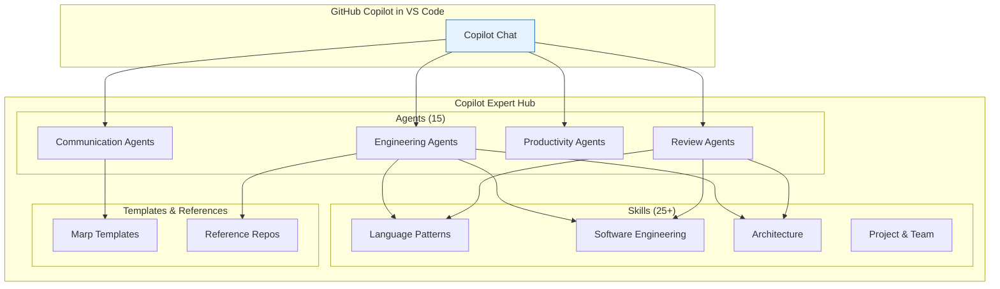
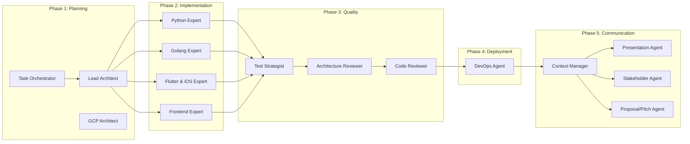

# Copilot Expert Hub Architecture

## Overview

The Copilot Expert Hub consists of three building blocks that work together:



---

## Agents

**Agents** are specialized AI personalities with a defined role, responsibilities, and workflow. Each agent has:

- **Identity** — Who am I? What is my expertise?
- **Core Responsibilities** — What are my main tasks?
- **Instructions** — How do I proceed? What rules do I follow?
- **Templates** — What output formats do I use?

Agents are defined as `.agent.md` files in the `agents/` directory and are automatically recognized by GitHub Copilot.

### Agent Lifecycle



---

## Skills

**Skills** are technical knowledge bases that agents use to provide well-founded recommendations. They contain:

- **Best Practices** with code examples
- **Patterns** for recurring problems
- **Anti-Patterns** — what to avoid
- **Decision guides** for technical choices

Skills are organized as Markdown files in the `skills/` directory — either as `SKILL.md` in a dedicated folder or as individual `.md` files in category folders.

### Skill Categories

| Category | Skills | Primary Users |
|----------|--------|---------------|
| Language Patterns | Python, Go, Flutter, Frontend | Implementation Agents |
| Software Engineering | Clean Code, SOLID, Design Patterns | All Agents |
| Architecture | Microservices, DDD, Cloud-Native | Lead Architect, GCP Architect |
| Project & Team | Agile, PR Crafting, Progress Sync | Task Orchestrator, Context Manager |

---

## Templates & References

### Marp Templates

Pre-built presentation templates for the Presentation Agent:

| Template | Audience | Purpose |
|----------|----------|---------|
| Client Pitch | Business Stakeholders | Selling solutions |
| Technical Deep-Dive | Engineers | Explaining architecture |
| Project Review | Stakeholders | Sprint/project status |

### Reference Repos

Golden-path examples for production architectures:

| Repo | Description |
|------|-------------|
| Python Golden | Production-grade Python project structure |
| Event-Driven Python | Event-Driven Architecture on GCP |

---

## Directory Structure

```
ai-agents/
├── agents/                     # 15 specialized AI Agents
│   ├── lead-architect.agent.md
│   ├── python-expert.agent.md
│   └── ...
├── skills/                     # 25+ technical knowledge bases
│   ├── python-patterns/
│   ├── software-engineering/
│   ├── architecture/
│   └── ...
├── marp-templates/             # 3 Marp Slide Templates
│   ├── client-pitch.md
│   ├── technical-deepdive.md
│   └── project-review.md
├── reference-repos/            # 2 Golden-Path References
│   ├── python-golden/
│   └── event-driven-python/
├── templates/                  # Templates for new Skills
│   └── skill-template.md
├── assets/mkdocs/              # MkDocs Documentation
├── copilot-instructions.md     # Global Copilot Configuration
├── justfile                    # Development Commands
└── mkdocs.yml                  # MkDocs Configuration
```

---

## Extensibility

The Hub is modular by design. New agents and skills can be added easily:

1. **New Agent:** Create an `.agent.md` file in `agents/` → [Guide](contributing/new-agent.md)
2. **New Skill:** Create a folder in `skills/` with `SKILL.md` → [Guide](contributing/new-skill.md)
3. **New Template:** Add a Marp file in `marp-templates/` → [Guidelines](contributing/guidelines.md)

```bash
# Using the Justfile:
just new-agent rust-expert
just new-skill rust-patterns
```
