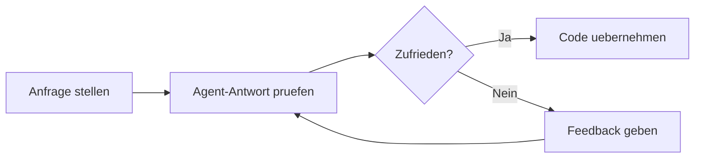

# Schnellstart

In 5 Minuten zum ersten AI-gestuetzten Code-Review oder Refactoring.

---

## 1. Agent auswaehlen

Waehle den passenden Agent fuer deine Aufgabe:

| Aufgabe | Agent |
|---------|-------|
| Python-Service entwickeln | `python-expert` |
| Architektur planen | `lead-architect` |
| Code Review durchfuehren | `code-reviewer` |
| Tests schreiben | `test-strategist` |
| CI/CD Pipeline erstellen | `devops-agent` |
| Frontend umsetzen | `frontend-expert` |

---

## 2. Chat oeffnen und Agent aufrufen

Oeffne den Copilot Chat und formuliere deine Anfrage:

### Beispiel: Python-Service refactoren

```
@workspace Nutze den Python Expert Agent.
Refactore den UserService in src/services/user_service.py.
Wende das Repository Pattern an und fuege Dependency Injection hinzu.
```

### Beispiel: Architektur-Review

```
@workspace Nutze den Architecture Reviewer Agent.
Pruefe die aktuelle Microservice-Architektur und identifiziere
Verbesserungspotenziale bei Kopplung und Kohäsion.
```

### Beispiel: Test-Strategie erstellen

```
@workspace Nutze den Test Strategist Agent.
Erstelle eine Teststrategie fuer den Payment-Service.
Beruecksichtige Unit Tests, Integration Tests und Contract Tests.
```

---

## 3. Skills ergaenzen

Fuer tiefere Expertise kannst du Skills hinzufuegen:

```
@workspace Nutze den Python Expert mit den Skills:
- Clean Code
- SOLID Principles
- Design Patterns (Repository, Factory)

Refactore die Datenbankzugriffe in src/repositories/.
```

---

## 4. Iterativ arbeiten

Die Agents arbeiten am besten im Dialog. Verfeinere die Ergebnisse:



!!! tip "Best Practice"
    Gib dem Agent konkretes Feedback: "Aendere die Fehlerbehandlung auf Custom Exceptions"
    statt "Mach es besser".

---

## 5. Ergebnisse validieren

- [x] Code-Aenderungen im Diff pruefen
- [x] Tests ausfuehren
- [x] Linting/Formatting pruefen
- [x] PR erstellen mit Agent-Unterstuetzung

```
@workspace Nutze den PR Crafting Skill.
Erstelle eine aussagekraeftige PR-Beschreibung fuer die
Aenderungen im UserService.
```

---

## Naechste Schritte

- :material-swap-horizontal: [Empfohlener Workflow](workflow.md) — Der optimale Agent-Workflow
- :material-robot: [Agent-Katalog](../agents/index.md) — Alle Agents im Detail
