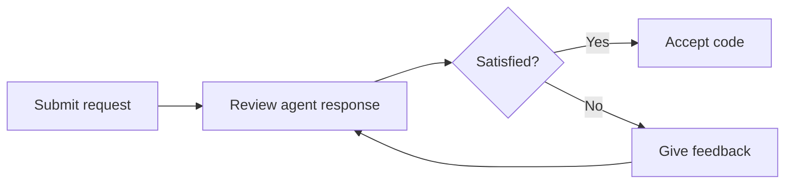

# Quick Start

Get your first AI-powered code review or refactoring done in 5 minutes.

---

## 1. Choose an Agent

Select the right agent for your task:

| Task | Agent |
|------|-------|
| Develop a Python service | `python-expert` |
| Plan architecture | `lead-architect` |
| Perform a code review | `code-reviewer` |
| Write tests | `test-strategist` |
| Create a CI/CD pipeline | `devops-agent` |
| Build a frontend | `frontend-expert` |

---

## 2. Open Chat and Invoke the Agent

Open Copilot Chat and formulate your request:

### Example: Refactor a Python Service

```
@workspace Use the Python Expert agent.
Refactor the UserService in src/services/user_service.py.
Apply the Repository Pattern and add Dependency Injection.
```

### Example: Architecture Review

```
@workspace Use the Architecture Reviewer agent.
Review the current microservice architecture and identify
improvement opportunities regarding coupling and cohesion.
```

### Example: Create a Test Strategy

```
@workspace Use the Test Strategist agent.
Create a test strategy for the Payment Service.
Include Unit Tests, Integration Tests, and Contract Tests.
```

---

## 3. Add Skills

For deeper expertise, you can add skills:

```
@workspace Use the Python Expert with the following skills:
- Clean Code
- SOLID Principles
- Design Patterns (Repository, Factory)

Refactor the database access layer in src/repositories/.
```

---

## 4. Work Iteratively

Agents work best in dialogue. Refine the results:



!!! tip "Best Practice"
    Give the agent specific feedback: "Change the error handling to use Custom Exceptions"
    instead of "Make it better".

---

## 5. Validate Results

- [x] Review code changes in the diff
- [x] Run tests
- [x] Check linting/formatting
- [x] Create a PR with agent assistance

```
@workspace Use the PR Crafting skill.
Create a meaningful PR description for the
changes in the UserService.
```

---

## Next Steps

- :material-swap-horizontal: [Recommended Workflow](workflow.md) — The optimal agent workflow
- :material-robot: [Agent Catalog](../agents/index.md) — All agents in detail
