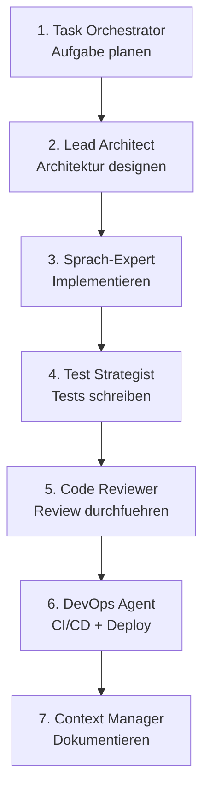

# Empfohlener Workflow

Der optimale Workflow nutzt die Agents in einer strukturierten Reihenfolge — von der Planung bis zum Deployment.

---

## Uebersicht



---

## Phase 1: Planung

### Task Orchestrator

Zerlege komplexe Aufgaben in handhabbare Schritte:

```
@workspace Nutze den Task Orchestrator Agent.
Plane die Implementierung eines neuen Notification-Service
mit E-Mail, SMS und Push-Benachrichtigungen.
```

**Ergebnis:** Strukturierter Implementierungsplan mit Abhaengigkeiten und Reihenfolge.

---

## Phase 2: Architektur

### Lead Architect

Entwirf die technische Architektur:

```
@workspace Nutze den Lead Architect Agent.
Entwirf die Architektur fuer den Notification-Service.
Beruecksichtige Event-Driven Architecture und das Strategy Pattern
fuer verschiedene Notification-Channels.
```

**Ergebnis:** Architektur-Diagramme, Komponentenstruktur, API-Design.

### Architecture Reviewer

Pruefe den Entwurf auf Schwachstellen:

```
@workspace Nutze den Architecture Reviewer Agent.
Pruefe den Architekturentwurf des Notification-Service
auf Skalierbarkeit, Fehlertoleranz und Wartbarkeit.
```

---

## Phase 3: Implementierung

### Sprach-spezifische Experts

Waehle den passenden Expert fuer deine Programmiersprache:

=== "Python"
    ```
    @workspace Nutze den Python Expert Agent.
    Implementiere den Notification-Service nach dem
    Architekturentwurf. Nutze FastAPI, SQLAlchemy und Celery.
    ```

=== "Frontend"
    ```
    @workspace Nutze den Frontend Expert Agent.
    Implementiere das Notification-Dashboard mit React
    und TypeScript. Nutze TanStack Query fuer Data Fetching.
    ```

=== "GCP"
    ```
    @workspace Nutze den GCP Architect Agent.
    Konfiguriere Cloud Pub/Sub fuer die Event-Verarbeitung
    und Cloud Functions fuer die Notification-Zustellung.
    ```

---

## Phase 4: Testing

### Test Strategist

Erstelle eine umfassende Teststrategie:

```
@workspace Nutze den Test Strategist Agent.
Erstelle Tests fuer den Notification-Service:
- Unit Tests fuer Business-Logik
- Integration Tests fuer DB und Message Queue
- Contract Tests fuer die REST API
- Performance Tests fuer Massenversand
```

---

## Phase 5: Review

### Code Reviewer

Fuehre ein gruendliches Code Review durch:

```
@workspace Nutze den Code Reviewer Agent.
Pruefe die Implementierung des Notification-Service.
Achte auf Error Handling, Security und Code Quality.
```

### PR Crafting

Erstelle einen professionellen Pull Request:

```
@workspace Nutze den PR Crafting Skill.
Erstelle eine PR-Beschreibung fuer den Notification-Service.
```

---

## Phase 6: Deployment

### DevOps Agent

Konfiguriere CI/CD und Deployment:

```
@workspace Nutze den DevOps Agent.
Erstelle eine GitHub Actions Pipeline fuer den Notification-Service:
- Build und Test
- Docker Image bauen
- Deploy auf GCP Cloud Run
```

---

## Phase 7: Dokumentation

### Context Manager

Sichere das Wissen fuer zukuenftige Aufgaben:

```
@workspace Nutze den Context Manager Agent.
Dokumentiere die Architekturentscheidungen und den
Implementierungsstand des Notification-Service.
```

---

## Rollenbasierte Einstiegspunkte

Je nach Rolle steigst du an unterschiedlichen Stellen ein:

| Rolle | Einstieg | Agents |
|-------|----------|--------|
| **Tech Lead** | Phase 1 | Task Orchestrator → Lead Architect |
| **Backend-Entwickler** | Phase 3 | Python Expert → Test Strategist |
| **Frontend-Entwickler** | Phase 3 | Frontend Expert → Test Strategist |
| **DevOps Engineer** | Phase 6 | DevOps Agent → GCP Architect |
| **Reviewer** | Phase 5 | Code Reviewer → Architecture Reviewer |

---

## Tipps fuer effektives Arbeiten

!!! tip "Kontext ist King"
    Je mehr Kontext du dem Agent gibst, desto besser die Ergebnisse.
    Referenziere konkrete Dateien, Patterns und Anforderungen.

!!! tip "Iterativ verfeinern"
    Akzeptiere nicht das erste Ergebnis. Gib Feedback und lasse
    den Agent seine Antwort verbessern.

!!! tip "Skills kombinieren"
    Kombiniere mehrere Skills fuer umfassendere Ergebnisse:
    Clean Code + SOLID + Design Patterns ergibt produktionsreifen Code.

!!! warning "Agent-Grenzen beachten"
    Agents ersetzen kein menschliches Urteil. Pruefe generierte
    Architekturentscheidungen und Security-relevanten Code immer manuell.
