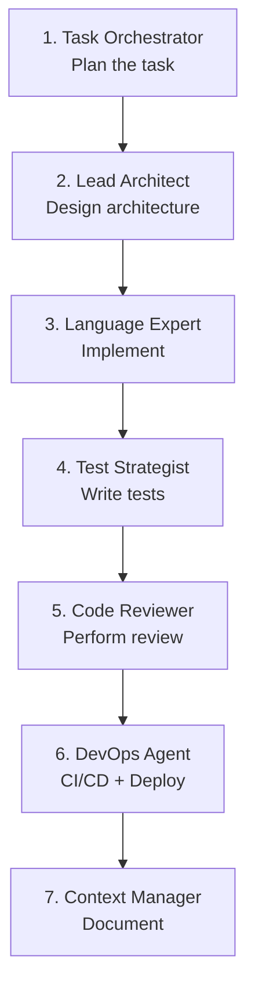

# Recommended Workflow

The optimal workflow uses agents in a structured sequence — from planning to deployment.

---

## Overview



---

## Phase 1: Planning

### Task Orchestrator

Break complex tasks into manageable steps:

```
@workspace Use the Task Orchestrator agent.
Plan the implementation of a new Notification Service
with email, SMS, and push notifications.
```

**Result:** Structured implementation plan with dependencies and sequencing.

---

## Phase 2: Architecture

### Lead Architect

Design the technical architecture:

```
@workspace Use the Lead Architect agent.
Design the architecture for the Notification Service.
Consider Event-Driven Architecture and the Strategy Pattern
for different notification channels.
```

**Result:** Architecture diagrams, component structure, API design.

### Architecture Reviewer

Review the design for weaknesses:

```
@workspace Use the Architecture Reviewer agent.
Review the Notification Service architecture design
for scalability, fault tolerance, and maintainability.
```

---

## Phase 3: Implementation

### Language-Specific Experts

Choose the right expert for your programming language:

=== "Python"
    ```
    @workspace Use the Python Expert agent.
    Implement the Notification Service following the
    architecture design. Use FastAPI, SQLAlchemy, and Celery.
    ```

=== "Frontend"
    ```
    @workspace Use the Frontend Expert agent.
    Implement the Notification Dashboard with React
    and TypeScript. Use TanStack Query for data fetching.
    ```

=== "GCP"
    ```
    @workspace Use the GCP Architect agent.
    Configure Cloud Pub/Sub for event processing
    and Cloud Functions for notification delivery.
    ```

---

## Phase 4: Testing

### Test Strategist

Create a comprehensive test strategy:

```
@workspace Use the Test Strategist agent.
Create tests for the Notification Service:
- Unit tests for business logic
- Integration tests for DB and message queue
- Contract tests for the REST API
- Performance tests for bulk sending
```

---

## Phase 5: Review

### Code Reviewer

Perform a thorough code review:

```
@workspace Use the Code Reviewer agent.
Review the Notification Service implementation.
Focus on error handling, security, and code quality.
```

### PR Crafting

Create a professional pull request:

```
@workspace Use the PR Crafting skill.
Create a PR description for the Notification Service.
```

---

## Phase 6: Deployment

### DevOps Agent

Configure CI/CD and deployment:

```
@workspace Use the DevOps Agent.
Create a GitHub Actions pipeline for the Notification Service:
- Build and test
- Build Docker image
- Deploy to GCP Cloud Run
```

---

## Phase 7: Documentation

### Context Manager

Preserve knowledge for future tasks:

```
@workspace Use the Context Manager agent.
Document the architecture decisions and the
implementation status of the Notification Service.
```

---

## Role-Based Entry Points

Depending on your role, you enter at different phases:

| Role | Entry Point | Agents |
|------|-------------|--------|
| **Tech Lead** | Phase 1 | Task Orchestrator → Lead Architect |
| **Backend Developer** | Phase 3 | Python Expert → Test Strategist |
| **Frontend Developer** | Phase 3 | Frontend Expert → Test Strategist |
| **DevOps Engineer** | Phase 6 | DevOps Agent → GCP Architect |
| **Reviewer** | Phase 5 | Code Reviewer → Architecture Reviewer |

---

## Tips for Effective Use

!!! tip "Context Is King"
    The more context you provide to the agent, the better the results.
    Reference specific files, patterns, and requirements.

!!! tip "Iterate and Refine"
    Don't accept the first result. Give feedback and let
    the agent improve its response.

!!! tip "Combine Skills"
    Combine multiple skills for more comprehensive results:
    Clean Code + SOLID + Design Patterns yields production-ready code.

!!! warning "Know the Agent's Limits"
    Agents don't replace human judgment. Always manually review
    generated architecture decisions and security-relevant code.
