# Copilot Expert Hub

<div class="hero" markdown>

## Your AI Engineering Team — Right Inside VS Code

**18 specialized agents** covering the entire Software Delivery Lifecycle:
Architecture, Code, Testing, Review, Deployment, IoT/Embedded, Creative, and Client Communication.
**Clone one repo. Ship better software immediately.**

[Get Started :material-rocket-launch:](getting-started/installation.md){ .md-button .md-button--primary }
[Explore Agents :material-robot:](agents/index.md){ .md-button }

</div>

---

## Full SDLC Coverage — Powered by AI

```mermaid
graph LR
    A["🎯 Planning"] --> B["🏗️ Architecture"]
    B --> C["💻 Implementation"]
    C --> D["🧪 Testing"]
    D --> E["🔍 Review"]
    E --> F["🚀 Deployment"]
    F --> G["📊 Communication"]

    style A fill:#e8eaf6,stroke:#3949ab
    style B fill:#e8eaf6,stroke:#3949ab
    style C fill:#e3f2fd,stroke:#1565c0
    style D fill:#e8f5e9,stroke:#2e7d32
    style E fill:#fff3e0,stroke:#e65100
    style F fill:#f3e5f5,stroke:#6a1b9a
    style G fill:#fce4ec,stroke:#c62828
```



<div class="stat-grid" markdown>
<div class="stat" markdown>
<span class="number">18</span>
<span class="label">AI Agents</span>
</div>
<div class="stat" markdown>
<span class="number">36</span>
<span class="label">Skills</span>
</div>
<div class="stat" markdown>
<span class="number">3</span>
<span class="label">Marp Templates</span>
</div>
<div class="stat" markdown>
<span class="number">2</span>
<span class="label">Reference Repos</span>
</div>
</div>

---

## Get Started in 3 Steps

<div class="grid" markdown>

<div class="card" markdown>
### :material-download: 1. Clone

```bash
git clone https://github.com/atstaeff/ai-agents.git
```
</div>

<div class="card" markdown>
### :material-microsoft-visual-studio-code: 2. Open in VS Code

```bash
code ai-agents
```
</div>

<div class="card" markdown>
### :material-robot: 3. Use an Agent

```
@workspace Use the Lead Architect agent
to design my new project.
```
</div>

</div>

:material-arrow-right: [Detailed Guide](getting-started/installation.md)

---

## Why Copilot Expert Hub?

<div class="grid" markdown>

<div class="card" markdown>
### :material-link-variant: Complete SDLC

No other open-source project covers the entire Software Delivery Lifecycle — from architecture design to client presentations.
</div>

<div class="card" markdown>
### :material-power-plug: Plug & Play

No setup, no configuration, no dependencies. Clone the repo, open VS Code, start working.
</div>

<div class="card" markdown>
### :material-shield-check: Enterprise Quality

Every agent enforces production standards: SOLID, DDD, Hexagonal Architecture, Test Pyramid, Security Hardening.
</div>

<div class="card" markdown>
### :material-open-source-initiative: Open Source & Extensible

MIT License. Add your own agents and skills. Community-driven and transparent.
</div>

</div>

:material-arrow-right: [Learn More](why-copilot-expert-hub.md)

---

## Agent Highlights

<div class="grid" markdown>

<div class="card" markdown>
### :material-drawing: Lead Architect
<span class="agent-badge badge-phase-plan">Architecture</span>

System design, ADRs, DDD, Event Sourcing — for thorough architecture decisions.

[:material-arrow-right: Details](agents/lead-architect.md)
</div>

<div class="card" markdown>
### :material-language-python: Python Expert
<span class="agent-badge badge-phase-build">Implementation</span>

Idiomatic Python 3.12+, Pydantic, async/await, Repository Pattern.

[:material-arrow-right: Details](agents/python-expert.md)
</div>

<div class="card" markdown>
### :material-magnify: Code Reviewer
<span class="agent-badge badge-phase-review">Review</span>

Automated code reviews focused on quality, security, and best practices.

[:material-arrow-right: Details](agents/code-reviewer.md)
</div>

<div class="card" markdown>
### :material-presentation: Stakeholder Agent
<span class="agent-badge badge-phase-communicate">Communication</span>

Translate technical results into business language — reports, summaries, pitches.

[:material-arrow-right: Details](agents/stakeholder-agent.md)
</div>

</div>

[:material-view-grid: View All 15 Agents](agents/index.md){ .md-button }

---

## Who Is This For?

| Role | Benefit | Entry Agents |
|------|---------|-------------|
| **Solo Developers & Freelancers** | One person, 15 experts — multiply your productivity | Python Expert, Lead Architect |
| **Engineering Teams** | Standardize quality, onboard juniors faster | Code Reviewer, Task Orchestrator |
| **Tech Leads & Architects** | Accelerate architecture decisions | Lead Architect, Architecture Reviewer |
| **Consultants & Agencies** | Deliver client artifacts faster | Stakeholder Agent, Presentation Agent |

---

## Community & Contributing

We're looking for **contributors**! Extend the hub with new agents, skills, or improvements.

<div class="grid" markdown>

<div class="card" markdown>
### :material-plus-circle: Contribute an Agent
Create a new specialized agent using our template.

[:material-arrow-right: Guide](contributing/new-agent.md)
</div>

<div class="card" markdown>
### :material-book-plus: Contribute a Skill
Add a technical knowledge base to the skills catalog.

[:material-arrow-right: Guide](contributing/new-skill.md)
</div>

<div class="card" markdown>
### :material-github: On GitHub
Open issues, create PRs, or discuss ideas.

[:material-arrow-right: Repository](https://github.com/atstaeff/ai-agents)
</div>

</div>

---

## License

MIT — see [LICENSE](https://github.com/atstaeff/ai-agents/blob/main/LICENSE) for details.
