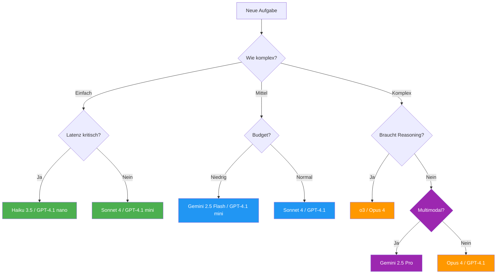

# LLM-Modell-Guide – Welches Modell für welche Aufgabe?

Dieser Guide hilft bei der Auswahl des richtigen LLM-Modells für verschiedene Aufgabentypen. Die Empfehlungen basieren auf Stand **Februar 2026** und werden regelmäßig aktualisiert.

!!! tip "Grundregel"
    Es gibt kein "bestes" Modell – nur das beste Modell **für die jeweilige Aufgabe**. Kosten, Latenz und Qualität müssen immer abgewogen werden.

---

## Schnellübersicht

| Aufgabe | Empfohlenes Modell | Alternativen |
|---------|-------------------|-------------|
| Komplexes Coding & Architektur | Claude Opus 4 | GPT-4.1, Gemini 2.5 Pro |
| Alltägliches Coding & Refactoring | Claude Sonnet 4 | GPT-4.1 mini, Gemini 2.5 Flash |
| Quick Fixes & Autovervollständigung | Claude Haiku 3.5, GPT-4.1 nano | Gemini 2.0 Flash Lite |
| Code Review & Analyse | Claude Opus 4 | GPT-4.1, Gemini 2.5 Pro |
| Tests schreiben | Claude Sonnet 4 | GPT-4.1, Gemini 2.5 Flash |
| Dokumentation & Texte | Claude Sonnet 4 | GPT-4.1, Gemini 2.5 Pro |
| Datenanalyse & Reasoning | Claude Opus 4 | o3, Gemini 2.5 Pro |
| Brainstorming & Ideation | Claude Sonnet 4 | GPT-4.1, Gemini 2.5 Flash |
| DevOps & Infrastruktur | Claude Sonnet 4 | GPT-4.1, Gemini 2.5 Flash |
| Multimodale Aufgaben (Bilder) | Gemini 2.5 Pro | Claude Opus 4, GPT-4.1 |

---

## Detaillierte Modellübersicht

### Anthropic Claude

| Modell | Version | Stärken | Schwächen | Ideal für |
|--------|---------|---------|-----------|-----------|
| **Claude Opus 4** | `claude-opus-4-20250514` | Tiefes Reasoning, exzellentes Coding, sehr gutes Instruktionsfolgen, Agent-Loops | Höhere Kosten, langsamer | Komplexe Architektur, Multi-File-Refactoring, schwierige Bugs, Code Review |
| **Claude Sonnet 4** | `claude-sonnet-4-20250514` | Sehr gute Balance aus Qualität und Speed, starkes Coding | Weniger tiefes Reasoning als Opus | Tägliches Coding, Tests, Dokumentation, Standard-Tasks |
| **Claude Haiku 3.5** | `claude-3-5-haiku-20241022` | Schnell, günstig, solide Qualität | Begrenzte Kontexttiefe | Autovervollständigung, einfache Edits, schnelle Fragen |

!!! info "Claude in GitHub Copilot"
    Claude Sonnet 4 ist das Default-Modell in GitHub Copilot Chat. Claude Opus 4 kann über das Modell-Dropdown ausgewählt werden und eignet sich besonders für den Agent-Modus.

---

### OpenAI GPT

| Modell | Version | Stärken | Schwächen | Ideal für |
|--------|---------|---------|-----------|-----------|
| **GPT-4.1** | `gpt-4.1-2025-04-14` | Sehr gutes Coding, gutes Instruktionsfolgen, langer Kontext (1M Tokens) | Kann bei sehr komplexem Reasoning hinter Claude zurückfallen | General-Purpose Coding, lange Codebases, API-Integration |
| **GPT-4.1 mini** | `gpt-4.1-mini-2025-04-14` | Schnell, kosteneffizient, gute Qualität | Weniger tiefes Reasoning | Alltägliches Coding, einfache Reviews, Dokumentation |
| **GPT-4.1 nano** | `gpt-4.1-nano-2025-04-14` | Extrem schnell, sehr günstig | Eingeschränkte Qualität bei komplexen Tasks | Autovervollständigung, Klassifikation, einfache Transformationen |
| **o3** | `o3-2025-04-16` | Bestes Reasoning, Chain-of-Thought | Langsam, teuer, kein Streaming | Mathematik, Logik, komplexe Algorithmen, schwierige Bugs |
| **o4-mini** | `o4-mini-2025-04-16` | Gutes Reasoning, schneller als o3 | Weniger tief als o3 | Reasoning-Tasks mit Zeitdruck, Code-Analyse |

!!! warning "Reasoning-Modelle (o3, o4-mini)"
    Die o-Serie ist für **Reasoning-Tasks** optimiert – nicht für schnelles Coding. Sie „denken" vor der Antwort und brauchen deutlich länger. Nur verwenden, wenn echtes Schlussfolgern benötigt wird.

---

### Google Gemini

| Modell | Version | Stärken | Schwächen | Ideal für |
|--------|---------|---------|-----------|-----------|
| **Gemini 2.5 Pro** | `gemini-2.5-pro-preview-05-06` | Multimodal, riesiger Kontext (1M+), starkes Reasoning, gutes Coding | Latenz variiert, API-Stabilität | Multimodale Tasks, große Codebases, Bild-/Diagrammanalyse |
| **Gemini 2.5 Flash** | `gemini-2.5-flash-preview-05-20` | Schnell, günstig, gute Qualität, Thinking-Budget steuerbar | Weniger tief als Pro | Alltägliche Tasks, schnelle Iterationen, kosteneffiziente Pipelines |
| **Gemini 2.0 Flash Lite** | `gemini-2.0-flash-lite` | Extrem schnell und günstig | Basisqualität | Einfache Klassifikation, Autovervollständigung, Bulk-Tasks |

!!! tip "Gemini Thinking-Budget"
    Gemini 2.5 Flash erlaubt die Steuerung des „Thinking-Budgets" – damit kann man die Balance zwischen Qualität und Geschwindigkeit pro Request anpassen.

---

## Empfehlungen nach Aufgabentyp

### :material-code-braces: Komplexes Coding & Architektur

Aufgaben wie Multi-File-Refactoring, Architektur-Entscheidungen, komplexe Feature-Implementierungen.

=== "Empfohlen"
    **Claude Opus 4** – Bestes Verständnis für große Codebases und komplexe Zusammenhänge. Exzellent im Agent-Modus.

=== "Alternative"
    **GPT-4.1** – Starke Alternative, besonders bei sehr langen Kontexten (1M Token Window).

=== "Budget"
    **Claude Sonnet 4** – Gute Qualität bei deutlich geringeren Kosten.

---

### :material-pencil: Alltägliches Coding

Standard-Implementierungen, Refactoring, Bug-Fixes, Boilerplate.

=== "Empfohlen"
    **Claude Sonnet 4** – Beste Balance aus Qualität, Geschwindigkeit und Kosten.

=== "Alternative"
    **GPT-4.1 mini** – Schnell und günstig bei solider Qualität.

=== "Budget"
    **Gemini 2.5 Flash** – Sehr kosteneffizient, gute Qualität.

---

### :material-bug: Debugging & Fehleranalyse

Schwierige Bugs, Race Conditions, Speicherlecks, Performance-Probleme.

=== "Empfohlen"
    **Claude Opus 4** – Tiefes Reasoning hilft bei schwer auffindbaren Bugs.

=== "Reasoning-intensiv"
    **o3** – Wenn systematisches Schlussfolgern über viele Schritte nötig ist.

=== "Schnelle Diagnose"
    **Claude Sonnet 4** – Für die meisten alltäglichen Bugs mehr als ausreichend.

---

### :material-test-tube: Tests schreiben

Unit Tests, Integration Tests, E2E Tests, Test-Strategien.

=== "Empfohlen"
    **Claude Sonnet 4** – Versteht Test-Patterns gut, generiert saubere Tests.

=== "Alternative"
    **GPT-4.1** – Ebenfalls sehr stark bei Test-Generierung.

=== "Komplex"
    **Claude Opus 4** – Wenn die Testlogik komplex ist oder viele Abhängigkeiten bestehen.

---

### :material-file-document: Dokumentation & Texte

README, API-Docs, ADRs, technische Spezifikationen, Kommentare.

=== "Empfohlen"
    **Claude Sonnet 4** – Natürlicher Schreibstil, gute Strukturierung.

=== "Alternative"
    **GPT-4.1** – Ebenfalls guter Schreibstil, besonders auf Englisch.

=== "Budget"
    **Gemini 2.5 Flash** – Ausreichend für Standard-Dokumentation.

---

### :material-eye: Code Review & Analyse

Pull-Request Reviews, Security-Audits, Performance-Analyse, Code-Qualität.

=== "Empfohlen"
    **Claude Opus 4** – Findet subtile Bugs und Architektur-Probleme.

=== "Alternative"
    **GPT-4.1** – Gute Reviews, besonders bei großen Diffs.

=== "Schnell"
    **Claude Sonnet 4** – Für Standard-Reviews völlig ausreichend.

---

### :material-image: Multimodale Aufgaben

Bild-Analyse, Diagramme verstehen, Screenshots auswerten, UI-Mockup-zu-Code.

=== "Empfohlen"
    **Gemini 2.5 Pro** – Stärkstes multimodales Verständnis, native Bildverarbeitung.

=== "Alternative"
    **Claude Opus 4** – Gutes Bildverständnis, kombiniert mit starkem Coding.

=== "Schnell"
    **GPT-4.1** – Solides Vision-Verständnis mit schneller Antwortzeit.

---

## Kosten-Vergleich (geschätzt)

!!! warning "Hinweis"
    Preise ändern sich häufig. Die folgenden Werte sind Richtwerte vom Stand Februar 2026.

| Modell | Input (pro 1M Tokens) | Output (pro 1M Tokens) | Relative Kosten |
|--------|----------------------|------------------------|-----------------|
| Claude Opus 4 | ~$15 | ~$75 | :material-currency-usd::material-currency-usd::material-currency-usd::material-currency-usd: |
| Claude Sonnet 4 | ~$3 | ~$15 | :material-currency-usd::material-currency-usd: |
| Claude Haiku 3.5 | ~$0.80 | ~$4 | :material-currency-usd: |
| GPT-4.1 | ~$2 | ~$8 | :material-currency-usd::material-currency-usd: |
| GPT-4.1 mini | ~$0.40 | ~$1.60 | :material-currency-usd: |
| GPT-4.1 nano | ~$0.10 | ~$0.40 | :fontawesome-solid-coins: |
| o3 | ~$2-$10 | ~$8-$40 | :material-currency-usd::material-currency-usd::material-currency-usd: |
| Gemini 2.5 Pro | ~$1.25-$2.50 | ~$10-$15 | :material-currency-usd::material-currency-usd: |
| Gemini 2.5 Flash | ~$0.15-$0.30 | ~$0.60-$2.50 | :material-currency-usd: |

---

## Entscheidungsbaum

---

## Tipps für den Alltag

### In GitHub Copilot

| Copilot-Feature | Empfohlenes Modell | Warum |
|-----------------|-------------------|-------|
| **Chat (Quick Questions)** | Claude Sonnet 4 (Default) | Schnell und gut genug für die meisten Fragen |
| **Agent Mode** | Claude Opus 4 | Braucht tiefes Verständnis für autonome Multi-Step-Tasks |
| **Inline Suggestions** | GPT-4.1 nano / Haiku 3.5 | Geschwindigkeit ist hier entscheidend |
| **Code Review** | Claude Opus 4 / GPT-4.1 | Qualität der Analyse ist wichtiger als Speed |
| **Explain Code** | Claude Sonnet 4 | Gute Erklärungen bei moderaten Kosten |

### Allgemeine Empfehlungen

1. **Start mit Sonnet/GPT-4.1 mini** – Für die meisten Tasks reichen diese Modelle völlig aus. Nur bei Bedarf hochskalieren.
2. **Opus/o3 gezielt einsetzen** – Diese Modelle kosten deutlich mehr. Nur verwenden, wenn die Aufgabe es rechtfertigt.
3. **Kontext-Fenster beachten** – Bei sehr großen Codebases kann GPT-4.1 (1M Tokens) oder Gemini 2.5 Pro (1M+ Tokens) Vorteile haben.
4. **Reasoning vs. Speed** – Die o-Serie (o3, o4-mini) ist für Reasoning optimiert. Für schnelles Coding sind sie nicht die beste Wahl.
5. **Iterieren** – Wenn ein Modell bei einer Aufgabe schwächelt, Modell wechseln statt endlose Re-Prompts.

---

## Changelog

| Datum | Änderung |
|-------|----------|
| 2026-02-15 | Initiale Version mit Stand Februar 2026 |

---

!!! note "Beitragen"
    Dieses Dokument lebt von Erfahrungswerten. Wenn du neue Erkenntnisse zu Modell-Eignung hast, erstelle gerne einen PR! Siehe [Contributing Guide](../contributing/index.md).
