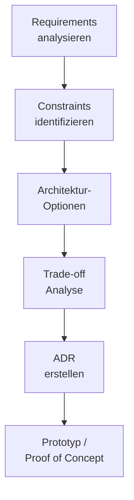

# Architecture Planning

> Architekturplanung mit C4 Model, Stakeholder-Analyse und strukturierten Entscheidungsprozessen.

---

## C4 Model

Vier Abstraktionsebenen fuer Softwarearchitektur-Diagramme:

| Ebene | Zeigt | Zielgruppe |
|-------|-------|------------|
| Context | System im Kontext externer Akteure | Alle |
| Container | Technische Bausteine (Apps, DBs, Queues) | Entwickler + Architekten |
| Component | Komponenten innerhalb eines Containers | Architekten + Entwickler |
| Code | Klassen, Interfaces | Entwickler |

## Planungsprozess

## Stakeholder-Analyse

| Stakeholder | Interesse | Einfluss |
|-------------|----------|---------|
| Product Owner | Features, Time-to-Market | Hoch |
| Entwickler | Developer Experience, Wartbarkeit | Hoch |
| Operations | Betreibbarkeit, Monitoring | Mittel |
| Security | Compliance, Datenschutz | Hoch |
| Management | Kosten, Time-to-Market | Hoch |

## Verwandte Skills

- [Domain-Driven Design](domain-driven-design.md) — Strategisches Design
- [Microservices](microservices.md) — Service-Architektur

---

*Quelldatei: [`skills/system-design/architecture-planning.md`](https://github.com/atstaeff/ai-agents/blob/main/skills/system-design/architecture-planning.md)*
