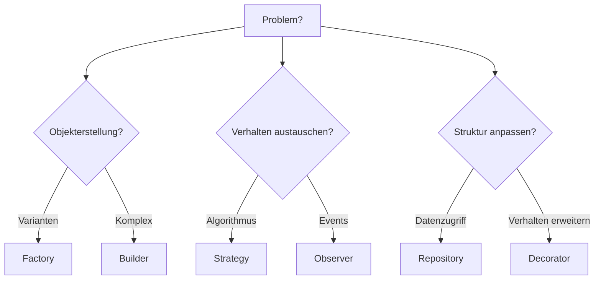

# Design Patterns

> Bewaehrte Entwurfsmuster fuer wiederkehrende Softwaredesign-Probleme — mit praktischen Beispielen in Python, Go und TypeScript.

---

## Ueberblick

### Creational Patterns

| Pattern | Zweck | Anwendungsfall |
|---------|-------|---------------|
| Factory | Objekterstellung abstrahieren | Verschiedene Reporttypen erzeugen |
| Builder | Komplexe Objekte schrittweise aufbauen | Query Builder, Config Builder |
| Singleton | Genau eine Instanz sicherstellen | Logger, Config (sparsam verwenden!) |

### Structural Patterns

| Pattern | Zweck | Anwendungsfall |
|---------|-------|---------------|
| Repository | Datenzugriff abstrahieren | DB-Zugriff von Business-Logik trennen |
| Adapter | Inkompatible Interfaces verbinden | Legacy-System integrieren |
| Decorator | Verhalten dynamisch erweitern | Logging, Caching, Retry |

### Behavioral Patterns

| Pattern | Zweck | Anwendungsfall |
|---------|-------|---------------|
| Strategy | Algorithmus austauschbar machen | Zahlungsanbieter, Sortierung |
| Observer | Event-basierte Entkopplung | Benachrichtigungen nach User-Registrierung |
| Template Method | Algorithmus-Skelett definieren | ETL-Prozess mit variablen Schritten |
| Chain of Responsibility | Request durch Handler-Kette leiten | Middleware, Validation Pipeline |

## Wann welches Pattern?

## Verwandte Skills

- [Clean Code](clean-code.md)
- [SOLID Principles](solid-principles.md)
- [Anti-Patterns](anti-patterns.md)

---

*Quelldatei: [`skills/software-engineering/design-patterns.md`](https://github.com/atstaeff/ai-agents/blob/main/skills/software-engineering/design-patterns.md)*
