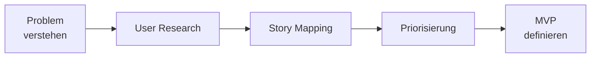

# Feature Discovery

> Anforderungsermittlung, Story Mapping und Feature-Discovery-Sessions fuer effektive Produktentwicklung.

---

## Discovery-Prozess



## Story Mapping

| Ebene | Beschreibung |
|-------|-------------|
| Aktivitaeten | Grosse Nutzer-Workflows (horizontal) |
| User Tasks | Einzelne Schritte (darunter) |
| User Stories | Konkrete Implementierungseinheiten |

## Discovery-Session Template

```markdown
## Ziel
Was wollen wir herausfinden?

## Teilnehmer
Product Owner, Tech Lead, UX, Domain Expert

## Agenda (90 Min)
1. Problem Statement (10 Min)
2. User Journey Mapping (30 Min)
3. Story Breakdown (30 Min)
4. Priorisierung + MVP (20 Min)

## Ergebnisse
- User Stories erstellt: X
- MVP-Scope definiert
- Offene Fragen: Y
```

## Verwandte Skills

- [Agile Methodologies](agile-methodologies.md) — Agile Planung
- [Communication](communication.md) — Workshop-Moderation

---

*Quelldatei: [`skills/team-collaboration/feature-discovery-session.md`](https://github.com/atstaeff/ai-agents/blob/main/skills/team-collaboration/feature-discovery-session.md)*
