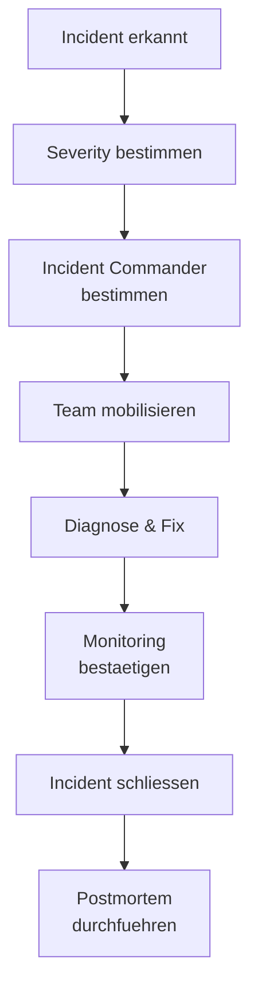

# Incident Response

> Incident Management, Eskalation, Postmortems und Koordination bei Produktionsvorfaellen.

---

## Incident Severity

| Level | Beschreibung | Response Time |
|-------|-------------|---------------|
| SEV-1 | System komplett ausgefallen | Sofort, War Room |
| SEV-2 | Grosse Funktionseinschraenkung | < 30 Minuten |
| SEV-3 | Kleinere Auswirkung | < 2 Stunden |
| SEV-4 | Kosmetisch / Minor | Naechster Arbeitstag |

## Incident-Workflow



## Rollen

| Rolle | Verantwortung |
|-------|--------------|
| Incident Commander | Koordination, Entscheidungen |
| Technical Lead | Diagnose und Fix |
| Communications | Stakeholder-Updates |
| Scribe | Timeline dokumentieren |

## Postmortem Template

```markdown
# Postmortem: {Incident-Titel}

## Summary
Was ist passiert, wie lange, welche Auswirkung?

## Timeline
| Zeit | Ereignis |
|------|---------|
| 14:00 | Alert ausgeloest |
| 14:05 | Incident Commander bestimmt |
| 14:30 | Root Cause identifiziert |
| 15:00 | Fix deployed |

## Root Cause
Warum ist es passiert?

## Action Items
- [ ] Monitoring verbessern
- [ ] Deployment Pipeline haerten
- [ ] Runbook aktualisieren
```

## Verwandte Skills

- [DevOps & CI/CD](devops-cicd.md) — Pipeline-Sicherheit
- [Communication](communication.md) — Krisenkommunikation

---

*Quelldatei: [`skills/team-collaboration/incident-response.md`](https://github.com/atstaeff/ai-agents/blob/main/skills/team-collaboration/incident-response.md)*
