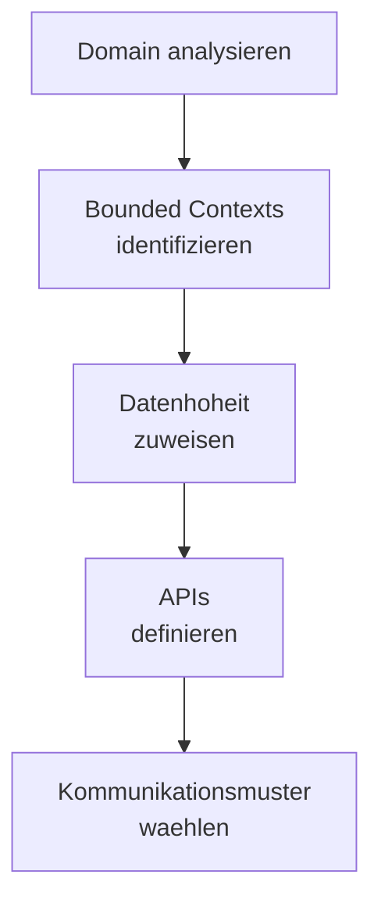

# Microservices

> Microservice-Architektur: Service-Schnitt, Kommunikation, Resilience und operationale Patterns.

---

## Kernprinzipien

| Prinzip | Beschreibung |
|---------|-------------|
| Single Responsibility | Ein Service, ein Business-Bereich |
| Loose Coupling | Minimale Abhaengigkeiten zwischen Services |
| High Cohesion | Zusammengehoerige Funktionalitaet im selben Service |
| Own Data | Jeder Service besitzt seine Daten |
| Smart Endpoints | Logik in Services, nicht in der Infrastruktur |

## Kommunikation

### Synchron

| Pattern | Anwendung |
|---------|----------|
| REST | Standard CRUD, oeffentliche APIs |
| gRPC | Interne Service-Kommunikation, Performance |
| GraphQL | Flexible Client-Abfragen |

### Asynchron

| Pattern | Anwendung |
|---------|----------|
| Event-Driven | Entkopplung, Event Sourcing |
| Message Queue | Zuverlaessige Zustellung, Retry |
| Pub/Sub | Fan-out, mehrere Consumer |

## Resilience Patterns

- **Circuit Breaker** — Fehlerhafte Services nicht endlos aufrufen
- **Retry with Backoff** — Transiente Fehler automatisch wiederholen
- **Bulkhead** — Ausfaelle isolieren
- **Timeout** — Keine endlosen Wartezeiten
- **Fallback** — Degraded Mode bei Ausfaellen

## Service-Schnitt

## Verwandte Skills

- [Domain-Driven Design](domain-driven-design.md) — Service-Schnitt mit DDD
- [Cloud-Native](cloud-native.md) — Cloud-native Microservices
- [API Design](api-design.md) — API-Schnittstellen

---

*Quelldatei: [`skills/architecture/microservices.md`](https://github.com/atstaeff/ai-agents/blob/main/skills/architecture/microservices.md)*
