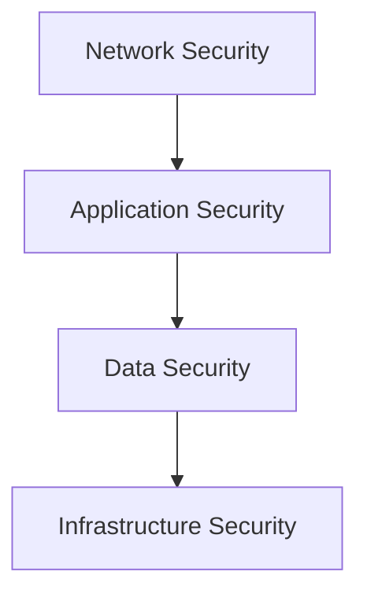

# Security Best Practices

> Authentication, Authorization, Input Validation, Encryption und sichere Softwareentwicklung.

---

## Security-Schichten

## Authentication & Authorization

| Thema | Best Practice |
|-------|-------------|
| Authentication | OAuth 2.0 / OIDC, JWT mit kurzer Lebensdauer |
| Authorization | RBAC oder ABAC, Least Privilege |
| Session | HttpOnly, Secure, SameSite Cookies |
| MFA | Fuer privilegierte Operationen erzwingen |

## Input Validation

- Alle Eingaben validieren (Frontend UND Backend)
- Whitelist statt Blacklist
- Pydantic / Zod fuer strukturierte Validierung
- Prepared Statements gegen SQL Injection
- Content Security Policy gegen XSS

## Secure Coding Checkliste

- [x] Keine Secrets im Quellcode
- [x] Secrets in Secret Manager (nicht Env Vars in Code)
- [x] Parametrisierte Queries (nie String-Konkatenation)
- [x] Input Validation auf allen Endpunkten
- [x] HTTPS everywhere
- [x] Security Headers (HSTS, CSP, X-Frame-Options)
- [x] Dependency Scanning (Dependabot, Snyk)
- [x] Logging ohne sensitiver Daten

## OWASP Top 10 Awareness

| Risiko | Gegenmassnahme |
|--------|---------------|
| Injection | Parametrisierte Queries, Input Validation |
| Broken Auth | OAuth 2.0, MFA, Session Management |
| Sensitive Data | Encryption at rest + in transit |
| XXE | XML-Parsing deaktivieren wenn moeglich |
| Broken Access | RBAC, Least Privilege, Tests |

## Verwandte Skills

- [API Design](api-design.md) — Sichere API-Schnittstellen
- [Cloud-Native](cloud-native.md) — Cloud Security

---

*Quelldatei: [`skills/architecture/security.md`](https://github.com/atstaeff/ai-agents/blob/main/skills/architecture/security.md)*
