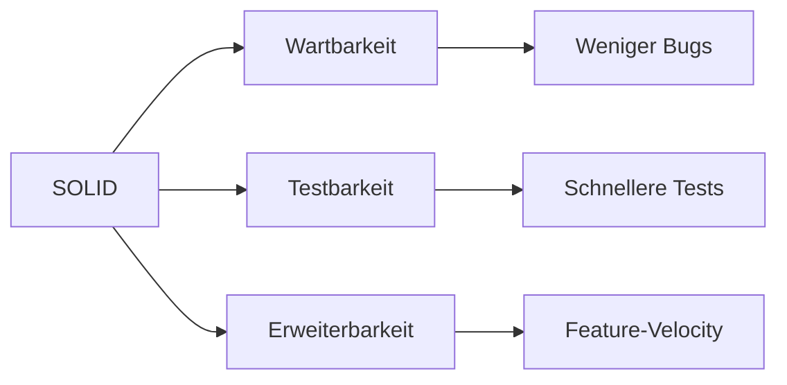

# SOLID Principles

> Die fuenf SOLID-Prinzipien fuer objektorientiertes Design — mit praktischen Before/After Beispielen.

---

## Die 5 Prinzipien

### S — Single Responsibility Principle (SRP)

> Eine Klasse sollte nur einen Grund haben, sich zu aendern.

| Vorher | Nachher |
|--------|---------|
| `Order` handhabt Daten UND Zahlungslogik | `Order` ist nur Daten, `PaymentProcessor` handhabt Zahlungen |

### O — Open/Closed Principle (OCP)

> Offen fuer Erweiterung, geschlossen fuer Modifikation.

| Vorher | Nachher |
|--------|---------|
| Neuer Zahlungsanbieter = bestehende Klasse aendern | Neuer Zahlungsanbieter = neue Klasse, Interface implementieren |

### L — Liskov Substitution Principle (LSP)

> Subtypen muessen durch ihren Basistyp ersetzbar sein.

| Vorher | Nachher |
|--------|---------|
| `Square` bricht `Rectangle`-Vertrag | Separate Abstraktionen, kein Vererbungsproblem |

### I — Interface Segregation Principle (ISP)

> Clients sollen nicht von Interfaces abhaengen, die sie nicht nutzen.

| Vorher | Nachher |
|--------|---------|
| Grosses Interface erzwingt unnoetige Implementierungen | Kleine, fokussierte Interfaces |

### D — Dependency Inversion Principle (DIP)

> High-Level Module sollen nicht von Low-Level Modulen abhaengen. Beide sollen von Abstraktionen abhaengen.

| Vorher | Nachher |
|--------|---------|
| `Switch` kennt `LightBulb` direkt | `Switch` haengt von `Switchable`-Abstraction ab |

## Anwendung in der Praxis

!!! tip "Pragmatismus"
    SOLID sind Richtlinien, keine Gesetze. Wende sie an, wo sie
    Komplexitaet reduzieren — nicht ueberall erzwingen.

## Verwandte Skills

- [Clean Code](clean-code.md)
- [Design Patterns](design-patterns.md)
- [Practical Refactoring](practical-refactoring.md)

---

*Quelldatei: [`skills/software-engineering/solid-principles.md`](https://github.com/atstaeff/ai-agents/blob/main/skills/software-engineering/solid-principles.md)*
