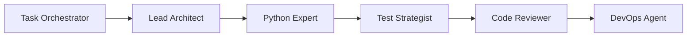
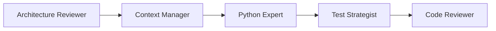
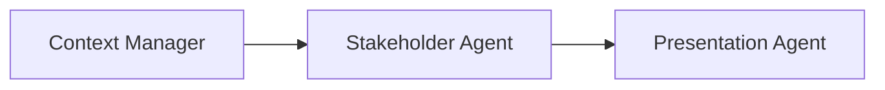
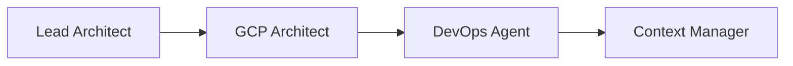
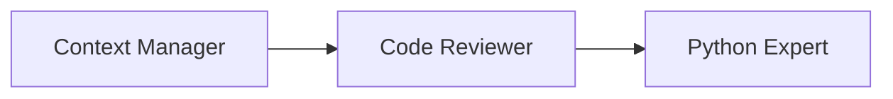
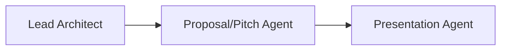

# Use Cases

Concrete scenarios showing how the Copilot Expert Hub is used in practice.

---

## :material-server: Build a New Microservice

**Situation:** You're starting a new backend project — an order management system with event-driven architecture.

**Agent Chain:**



**Steps:**

1. **Task Orchestrator** breaks the project into epics and tasks
2. **Lead Architect** designs the architecture with ADRs and C4 diagrams
3. **Python Expert** implements domain models, services, and API endpoints
4. **Test Strategist** defines the test strategy and implements tests
5. **Code Reviewer** reviews code quality, security, and best practices
6. **DevOps Agent** creates Dockerfile, CI/CD pipeline, and deployment

**Example Prompt:**

```
@workspace Use the Lead Architect agent to design an event-driven
architecture for an order management system.
Use DDD, Hexagonal Architecture, and Pub/Sub for events.
```

---

## :material-wrench: Refactor Legacy Code

**Situation:** A mature Python project has accumulated technical debt — no tests, coupled modules, unclear architecture.

**Agent Chain:**



**Steps:**

1. **Architecture Reviewer** analyzes the existing architecture and identifies risks
2. **Context Manager** documents the current state and decisions
3. **Python Expert** refactors step-by-step using Repository Pattern, DI, and Clean Architecture
4. **Test Strategist** adds tests — characterization tests first, then unit tests
5. **Code Reviewer** ensures each refactoring step improves quality

**Example Prompt:**

```
@workspace Use the Architecture Reviewer agent. Analyze the
existing codebase and create a refactoring plan prioritized
by risk and effort.
```

---

## :material-presentation-play: Prepare a Sprint Review

**Situation:** End of sprint — you need to present progress to the client.

**Agent Chain:**



**Steps:**

1. **Context Manager** gathers all relevant changes, PRs, and decisions
2. **Stakeholder Agent** translates technical details into business language with KPIs
3. **Presentation Agent** creates a Marp slide deck using the Project Review template

**Example Prompt:**

```
@workspace Use the Stakeholder Agent. Create a sprint review
report for Sprint 4. Focus on business impact and demo-ready
features.
```

---

## :material-cloud-upload: Plan a Cloud Migration

**Situation:** An on-premise system needs to be migrated to Google Cloud Platform.

**Agent Chain:**



**Steps:**

1. **Lead Architect** designs the target architecture (Cloud-Native, 12-Factor)
2. **GCP Architect** selects the appropriate GCP services (Cloud Run, Cloud SQL, Pub/Sub)
3. **DevOps Agent** creates Terraform modules, CI/CD pipelines, and monitoring
4. **Context Manager** documents all migration decisions as ADRs

**Example Prompt:**

```
@workspace Use the GCP Architect agent. Design a cloud-native
architecture on GCP for our existing monolith backend.
Use Cloud Run, Cloud SQL, and Pub/Sub.
```

---

## :material-account-school: Onboard a New Team Member

**Situation:** A junior developer is joining the team and needs to become productive quickly.

**Agent Chain:**



**Steps:**

1. **Context Manager** provides project context, architecture overview, and ADRs
2. **Code Reviewer** gives constructive feedback on initial PRs
3. **Python Expert** explains patterns, conventions, and best practices in the project context

**Example Prompt:**

```
@workspace Use the Context Manager agent. Give me a complete
overview of the project: architecture, tech stack, key decisions,
and conventions.
```

---

## :material-file-document: Create a Project Proposal

**Situation:** You need to create a technical proposal for a new client.

**Agent Chain:**



**Steps:**

1. **Lead Architect** outlines the technical solution and feasibility
2. **Proposal/Pitch Agent** creates a roadmap, milestones, and effort estimates
3. **Presentation Agent** packages everything into a Client Pitch Marp deck

**Example Prompt:**

```
@workspace Use the Proposal/Pitch Agent. Create a project
proposal for an IoT monitoring platform with a 3-month
roadmap and milestones.
```

---

:material-arrow-right: [View All Agents](agents/index.md){ .md-button }
:material-arrow-right: [Get Started](getting-started/installation.md){ .md-button .md-button--primary }
