# Why Copilot Expert Hub?

## The Problem

Modern software development requires expertise across many domains: architecture, multiple programming languages, testing, security, DevOps, client communication. **No single developer can be an expert in everything.**

GitHub Copilot is powerful — but without context and specialized instructions, it produces generic code. It lacks the expertise of a senior engineer who systematically applies best practices, patterns, and architecture decisions.

---

## The Solution

The Copilot Expert Hub turns GitHub Copilot into a **team of 15 specialized senior engineers**:

```mermaid
graph TB
    subgraph "🎯 Planning & Architecture"
        A[Task Orchestrator] --> B[Lead Architect]
        B --> C[GCP Architect]
    end

    subgraph "💻 Implementation"
        D[Python Expert]
        E[Golang Expert]
        F["Flutter & iOS Expert"]
        G[Frontend Expert]
    end

    subgraph "🧪 Quality"
        H[Test Strategist]
        I[Architecture Reviewer]
        J[Code Reviewer]
    end

    subgraph "🚀 Deployment"
        K[DevOps Agent]
    end

    subgraph "📊 Communication"
        L[Context Manager]
        M[Presentation Agent]
        N[Stakeholder Agent]
        O["Proposal/Pitch Agent"]
    end

    B --> D & E & F & G
    D & E & F & G --> H
    H --> I --> J
    J --> K
    K --> L --> M & N & O
```



---

## What Makes Us Unique

### :material-link-variant: Complete SDLC in One Repository

| Other Tools | Copilot Expert Hub |
|-------------|-------------------|
| Individual prompts or snippets | **15 specialized agents** as a cohesive system |
| Code generation only | **Full lifecycle:** Planning → Code → Test → Review → Deploy → Communication |
| Generic AI assistance | **Role-based expertise** with concrete best practices |
| Configuration required | **Plug & Play:** Clone and use immediately |

### :material-shield-check: Enterprise-Grade Quality

Every agent enforces proven production standards:

- **SOLID Principles** & Clean Code in every implementation
- **Domain-Driven Design** & Hexagonal Architecture
- **Test Pyramid** with unit, integration, and E2E tests
- **Security Hardening** — Input Validation, AuthN/AuthZ, Encryption
- **Architecture Decision Records (ADRs)** for traceable decisions

### :material-puzzle: Modular Skills System

Agents are intelligent thanks to **25+ skills** — technical knowledge bases covering:

- Language-specific patterns (Python, Go, Flutter, TypeScript)
- Software engineering (Clean Code, SOLID, Design Patterns)
- Architecture (Microservices, DDD, Cloud-Native, API Design)
- Project management (Agile, Technical Debt, PR Crafting)

### :material-open-source-initiative: Open & Extensible

- **MIT License** — free for personal and commercial use
- **Community-driven** — contribute your own agents and skills
- **Template-based** — quickly create new agents and skills
- **No lock-in** — works with any project, any language

---

## Comparison

| Feature | Copilot Expert Hub | Individual Prompts | Custom Instructions |
|---------|-------------------|-------------------|-------------------|
| Specialized Roles | :material-check: 15 Agents | :material-close: | :material-close: |
| SDLC Coverage | :material-check: Complete | :material-close: | :material-close: |
| Technical Skills | :material-check: 25+ | :material-close: | Limited |
| Marp Templates | :material-check: 3 | :material-close: | :material-close: |
| Reference Repos | :material-check: 2 | :material-close: | :material-close: |
| Open Source | :material-check: MIT | Varies | :material-close: |
| Ready to Use | :material-check: | :material-check: | Effort Required |
| Team Workflow | :material-check: Agent Chain | :material-close: | :material-close: |

---

## Example Scenarios

### :material-server: Build a Microservice

```
Task Orchestrator → Lead Architect → Python Expert → Test Strategist → Code Reviewer → DevOps Agent
```

The Task Orchestrator breaks down the work, the Lead Architect designs the architecture with ADRs, the Python Expert implements idiomatic Python, the Test Strategist ensures quality, the Code Reviewer reviews everything, and the DevOps Agent sets up CI/CD.

### :material-presentation-play: Create a Client Presentation

```
Context Manager → Stakeholder Agent → Presentation Agent
```

The Context Manager gathers the project context, the Stakeholder Agent translates technical details into business language, and the Presentation Agent creates a professional Marp slide deck.

### :material-account-group: Onboard a Junior Developer

```
Context Manager → Code Reviewer → Python Expert
```

The Context Manager provides project context, the Code Reviewer gives constructive feedback on PRs, and the Python Expert explains patterns and best practices.

---

:material-arrow-right: [Get Started](getting-started/installation.md){ .md-button .md-button--primary }
