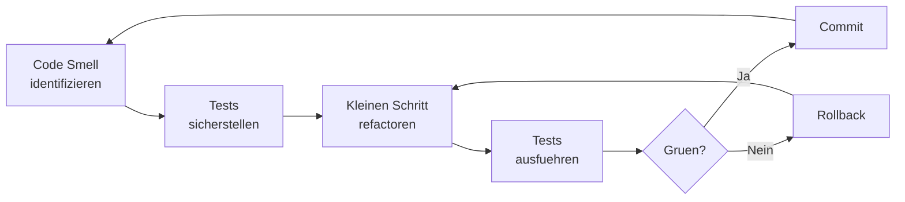

# Practical Refactoring

> Pragmatische Refactoring-Taktiken und Workflows fuer den Alltag. Vom Code Smell zum Clean Code.

---

## Refactoring-Workflow

## Haeufige Code Smells

| Smell | Refactoring |
|-------|-------------|
| Lange Funktion | Extract Method |
| Grosse Klasse | Extract Class |
| Parameter-Liste | Introduce Parameter Object |
| Feature Envy | Move Method |
| Primitive Obsession | Replace Primitive with Value Object |
| Duplicated Code | Extract Method / Template Method |
| God Object | Decompose nach SRP |
| Shotgun Surgery | Move Method, Inline Class |

## Strategien

### Strangler Fig Pattern

Fuer grosse Legacy-Systeme: Neue Funktionalitaet um das alte System herum bauen und schrittweise ersetzen.

### Branch by Abstraction

1. Abstraction (Interface) erstellen
2. Alte Implementierung hinter Interface setzen
3. Neue Implementierung schreiben
4. Feature Flag zum Umschalten
5. Alte Implementierung entfernen

### Mikado Method

Refactoring-Abhaengigkeiten als Graph visualisieren und von den Blaettern her aufloesen.

## Verwandte Skills

- [Clean Code](clean-code.md)
- [Design Patterns](design-patterns.md)
- [Technical Debt](technical-debt.md)

---

*Quelldatei: [`skills/software-engineering/practical-refactoring.md`](https://github.com/atstaeff/ai-agents/blob/main/skills/software-engineering/practical-refactoring.md)*
