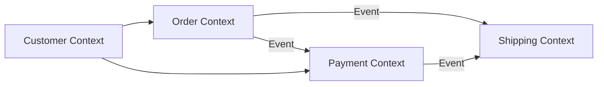

# Domain-Driven Design

> Strategisches und taktisches DDD fuer komplexe Softwaresysteme — Bounded Contexts, Aggregates und Domain Events.

---

## Strategisches Design

### Bounded Contexts

Klar abgegrenzte Modelle mit eigener Ubiquitous Language:

### Context Mapping

| Pattern | Beschreibung |
|---------|-------------|
| Shared Kernel | Gemeinsamer Code zwischen Contexts |
| Customer/Supplier | Upstream liefert, Downstream konsumiert |
| Anti-Corruption Layer | Uebersetzungsschicht gegen fremde Modelle |
| Open Host Service | Oeffentliche API mit Published Language |

## Taktisches Design

### Building Blocks

| Block | Zweck |
|-------|-------|
| Entity | Identitaet ueber Zeit, veraenderbar |
| Value Object | Wertgleichheit, unveraenderlich |
| Aggregate | Konsistenzgrenze, Root Entity |
| Domain Event | Fachliches Ereignis, unveraenderlich |
| Repository | Persistent-Abstraktion fuer Aggregates |
| Domain Service | Logik die keiner Entity gehoert |

### Aggregate-Regeln

1. Kleinstmoegliche Aggregates
2. Referenzen zwischen Aggregates nur ueber ID
3. Konsistenz innerhalb, Eventual Consistency zwischen Aggregates
4. Aenderungen ueber die Aggregate Root

## Verwandte Skills

- [Microservices](microservices.md) — Service-Schnitt mit Bounded Contexts
- [Architecture Planning](architecture-planning.md) — Architekturplanung

---

*Quelldatei: [`skills/architecture/domain-driven-design.md`](https://github.com/atstaeff/ai-agents/blob/main/skills/architecture/domain-driven-design.md)*
