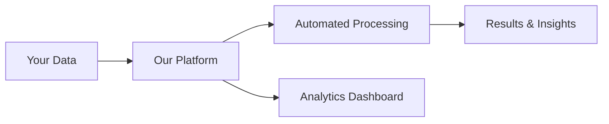

<!-- _class: lead -->

# {Project Name}
## Client Pitch — {Date}

**Prepared for:** {Client Name}
**Presented by:** {Your Name}

---

# Agenda

1. 🎯 Understanding Your Challenge
2. 💡 Our Proposed Solution
3. 🏗️ Technical Approach
4. 📅 Timeline & Milestones
5. 💰 Investment
6. ✅ Next Steps

---

# The Challenge

> "{Client's pain point in their own words}"

**Current Situation**
- Manual processes taking {X} hours/week
- Error rate of {X}%
- Scaling limitations

**Business Impact**
- €{X,XXX}/month in operational cost
- {X} FTEs on repetitive tasks
- Missed market opportunities

---

# Our Solution

## {Solution Name}

A **modern, scalable platform** that:

- ⚡ Automates {process} — saving {X} hours/week
- 📊 Provides real-time {analytics/insights}
- 🔗 Integrates with {existing systems}
- 🔒 Enterprise-grade security & compliance

---

# Key Benefits

**Efficiency**
- 90% faster processing
- 80% fewer manual tasks
- Real-time visibility

**Business Value**
- €{XXX,XXX} annual savings
- {X}x ROI within 12 months
- Competitive advantage

---

# Technical Approach (Simplified)

- **Cloud-native** — scalable, reliable, secure
- **API-first** — integrates with your existing tools
- **Future-proof** — modular, extensible architecture

---

# Delivery Timeline

| Phase | Duration | What You Get |
|-------|----------|-------------|
| 🔍 Discovery | 2 weeks | Validated requirements, architecture |
| 🚀 MVP | 6 weeks | Core features, working prototype |
| 🔧 Enhancement | 4 weeks | Full feature set, integrations |
| ✅ Launch | 2 weeks | Production deployment, training |

**Total: ~14 weeks to production**

---

# Investment

| Component | Investment |
|-----------|-----------|
| Discovery & Design | €{XX,XXX} |
| MVP Development | €{XX,XXX} |
| Enhancement & Integration | €{XX,XXX} |
| Launch & Support | €{XX,XXX} |
| **Total** | **€{XXX,XXX}** |

**Expected ROI: {X}x within 12 months**

---

# Why Us

- ✅ **Deep expertise** in {domain/technology}
- ✅ **Proven track record** — {X} similar projects delivered
- ✅ **Agile delivery** — working software every 2 weeks
- ✅ **Transparent** — clear communication, no surprises
- ✅ **Partnership** — we succeed when you succeed

---

# Next Steps

1. 📋 **Feedback & Questions** — Today
2. 🤝 **Agreement & Kick-off** — Within 1 week
3. 🔍 **Discovery Sprint** — Week 1-2
4. 🚀 **First Demo** — Week 4

---

<!-- _class: lead -->

# Thank You!

## Questions?

**{Your Name}** — {email}
**{Your Company}** — {website}
