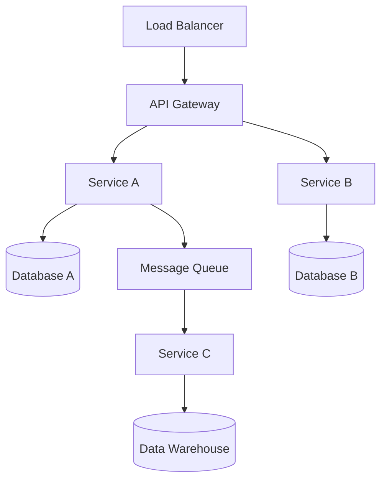
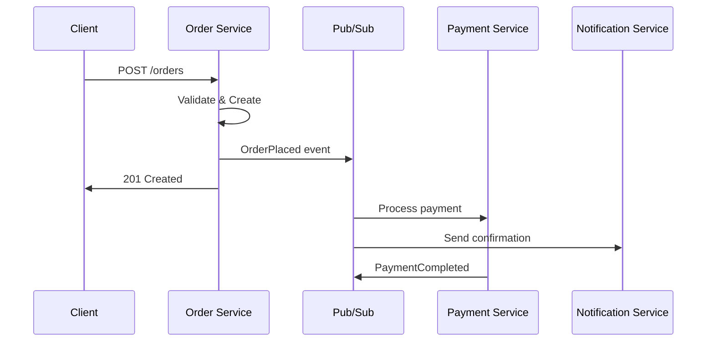

<!-- _class: lead -->

# {System Name}
## Technical Deep-Dive — Architecture & Implementation

**Date:** {Date}
**Author:** {Engineer Name}

---

# Agenda

1. 🎯 System Overview & Goals
2. 🏗️ Architecture Design
3. 📦 Key Components
4. 🔄 Communication Patterns
5. 🧪 Testing Strategy
6. 🚀 Deployment & Operations
7. 📈 Performance & Scaling

---

# System Overview

## Problem Statement
{What problem does this system solve?}

## Design Goals
- **Scalability** — Handle {X}k requests/sec
- **Reliability** — 99.9% uptime SLA
- **Maintainability** — Independent deployments
- **Security** — Zero-trust architecture

---

# High-Level Architecture



---

# Bounded Contexts

<div class="columns">

**Domain Boundaries**
- 📦 Order Management
- 👤 Customer Identity
- 💳 Payment Processing
- 📊 Analytics & Reporting

**Communication**
- Sync: REST/gRPC (within context)
- Async: Events via Pub/Sub (between contexts)
- No shared databases

</div>

---

# Tech Stack

| Layer | Technology | Why |
|-------|-----------|-----|
| **API** | FastAPI | Async, type-safe, OpenAPI |
| **Runtime** | Cloud Run | Serverless, auto-scaling |
| **Database** | Cloud SQL (PostgreSQL) | ACID, JSON support |
| **Events** | Pub/Sub | At-least-once, scalable |
| **Cache** | Memorystore (Redis) | Low latency, sessions |
| **IaC** | Terraform | Reproducible infrastructure |
| **CI/CD** | GitHub Actions | Native integration |

---

# Domain Model

```python
class Order(BaseModel):
    id: UUID = Field(default_factory=uuid4)
    customer_id: UUID
    items: list[OrderItem]
    status: OrderStatus
    created_at: datetime

    @property
    def total(self) -> Decimal:
        return sum(item.subtotal for item in self.items)
```

> Using Pydantic v2 for validation, serialization, and OpenAPI schema generation.

---

# Service Architecture

```python
class OrderService:
    def __init__(
        self,
        repo: OrderRepository,    # Protocol
        events: EventBus,          # Protocol
        payments: PaymentGateway,  # Protocol
    ) -> None: ...

    async def place_order(self, cmd: PlaceOrder) -> Order:
        order = Order.create(cmd)
        await self.repo.save(order)
        await self.events.publish(OrderPlaced(...))
        return order
```

> Dependency injection via Protocols — fully testable.

---

# Event Flow



---

# Testing Strategy

```
        /\
       / E2E \         Critical user journeys
      /--------\
     / Integration \   DB, Pub/Sub, API tests
    /----------------\
   /   Unit Tests     \  Domain logic, services
  /--------------------\
```

| Type | Tools | Coverage Target |
|------|-------|-----------------|
| Unit | pytest, factories, fakes | 80%+ |
| Integration | testcontainers, httpx | 60%+ |
| E2E | playwright, API tests | Critical paths |

---

# Deployment Pipeline

```
PR Created → Lint & Type Check → Unit Tests
                                      ↓
                              Integration Tests
                                      ↓
                              Build Container
                                      ↓
                              Deploy Staging
                                      ↓
                              Smoke Tests
                                      ↓
                         Deploy Production (Canary)
                                      ↓
                           10% → 50% → 100%
```

---

# Performance Targets

| Metric | Target | Strategy |
|--------|--------|----------|
| P50 Latency | < 50ms | Caching, connection pooling |
| P99 Latency | < 200ms | Async processing |
| Throughput | 10k req/s | Horizontal scaling |
| Error Rate | < 0.1% | Circuit breakers, retries |
| Availability | 99.9% | Multi-zone, health checks |

---

# Key ADRs

| ADR | Decision | Rationale |
|-----|----------|-----------|
| ADR-001 | Event-driven architecture | Loose coupling, scalability |
| ADR-002 | Cloud Run over GKE | Cost efficiency, simplicity |
| ADR-003 | PostgreSQL over Firestore | ACID, complex queries |
| ADR-004 | Pub/Sub over Kafka | Managed, GCP-native |

---

# Open Questions & Discussion

- ❓ {Technical question 1}
- ❓ {Technical question 2}
- ❓ {Design trade-off to discuss}

---

<!-- _class: lead -->

# Questions?

Repository: `github.com/org/project`
Docs: `docs.internal.company.com/project`
