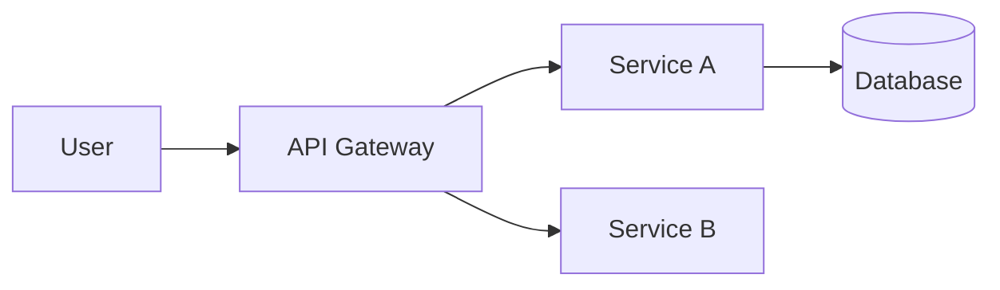

# Marp Presentations Skill

## Instructions for AI

Create professional Marp-based presentations. Use this skill when creating slide decks for clients, technical audiences, or project reviews.

## Marp Basics

Marp converts Markdown to presentation slides. Each slide is separated by `---`.

### Minimal Slide Deck

```markdown
---
marp: true
theme: default
paginate: true
---

# Slide Title

Content goes here.

---

# Second Slide

- Point 1
- Point 2
- Point 3
```

## Styling

### Custom Theme with CSS

```markdown
---
marp: true
style: |
  section {
    font-family: 'Inter', 'Segoe UI', sans-serif;
    background-color: #ffffff;
    color: #333333;
  }
  h1 {
    color: #1a73e8;
    border-bottom: 2px solid #1a73e8;
    padding-bottom: 0.3em;
  }
  h2 {
    color: #5f6368;
  }
  .highlight {
    color: #1a73e8;
    font-weight: bold;
  }
  .columns {
    display: grid;
    grid-template-columns: 1fr 1fr;
    gap: 2rem;
  }
  .three-columns {
    display: grid;
    grid-template-columns: 1fr 1fr 1fr;
    gap: 1.5rem;
  }
  table {
    font-size: 0.85em;
  }
  blockquote {
    border-left: 4px solid #1a73e8;
    padding-left: 1em;
    font-style: italic;
    color: #5f6368;
  }
---
```

### Size & Direction

```markdown
---
marp: true
size: 16:9           # or 4:3
paginate: true
header: "Company Name"
footer: "© 2026 — Confidential"
---
```

## Layout Patterns

### Two Columns

```markdown
<div class="columns">

**Left Column**
- Feature A
- Feature B
- Feature C

**Right Column**
- Benefit 1
- Benefit 2
- Benefit 3

</div>
```

### Full-Width Image

```markdown
---
<!-- _backgroundImage: url('image.png') -->
<!-- _backgroundSize: cover -->
<!-- _color: white -->

# Title on Image Background
```

### Centered Content

```markdown
---
<!-- _class: lead -->

# Big Statement

## Supporting text below

---
```

## Diagram Integration

### Mermaid Diagrams

```markdown

```

### Timeline with Table

```markdown
| Phase | Timeline | Deliverable |
|-------|----------|-------------|
| Discovery | Week 1-2 | Architecture Design |
| MVP | Week 3-8 | Core Features |
| Beta | Week 9-12 | Integration & Testing |
| Launch | Week 13-14 | Production Deployment |
```

## Presentation Types

| Type | Audience | Focus | Template |
|------|----------|-------|----------|
| **Client Pitch** | Business stakeholders | Value, ROI, timeline | [client-pitch.md](../../marp-templates/client-pitch.md) |
| **Technical Deep-Dive** | Engineers, architects | Architecture, code, patterns | [technical-deepdive.md](../../marp-templates/technical-deepdive.md) |
| **Project Review** | Mixed audience | Progress, metrics, next steps | [project-review.md](../../marp-templates/project-review.md) |

## Speaker Notes

```markdown
---

# Slide Title

Content visible on slide.

<!-- 
Speaker notes:
- Talk about this point in detail
- Mention the customer example
- Transition: "This brings us to..."
-->
```

## Best Practices

✅ One idea per slide
✅ Rule of Three: max 3 bullet points per slide
✅ Use visuals (diagrams, charts) over text
✅ Consistent styling throughout
✅ Include speaker notes for every content slide
✅ End with clear call to action
✅ Test export to PDF and HTML

## Anti-Patterns

❌ Wall of text on a single slide
❌ More than 6 bullet points
❌ Inconsistent fonts or colors

## Related Skills

- [Presentation Agent](../../agents/presentation-agent.agent.md)
- [Proposal/Pitch Agent](../../agents/proposal-pitch.agent.md)
- [Stakeholder Agent](../../agents/stakeholder-agent.agent.md)
- [Communication](../general/communication.md)
❌ No clear narrative/flow
❌ Missing speaker notes
❌ Too many slides (aim for 1 slide per 2 minutes)

## Marp CLI Commands

```bash
# Preview in browser
npx @marp-team/marp-cli slides.md --preview

# Export to PDF
npx @marp-team/marp-cli slides.md --pdf

# Export to PPTX
npx @marp-team/marp-cli slides.md --pptx

# Export to HTML
npx @marp-team/marp-cli slides.md --html

# Watch mode
npx @marp-team/marp-cli slides.md --preview --watch
```

## Example Prompts

- "Create a Marp presentation for a client pitch about a cloud migration"
- "Build a technical deep-dive slide deck for our new event-driven architecture"
- "Generate a project review presentation with sprint metrics"
- "Convert this technical document into a 10-slide presentation"

## Related Skills

- [Presentation Agent](../../.github/agents/presentation-agent.agent.md)
- [Stakeholder Agent](../../.github/agents/stakeholder-agent.agent.md)
