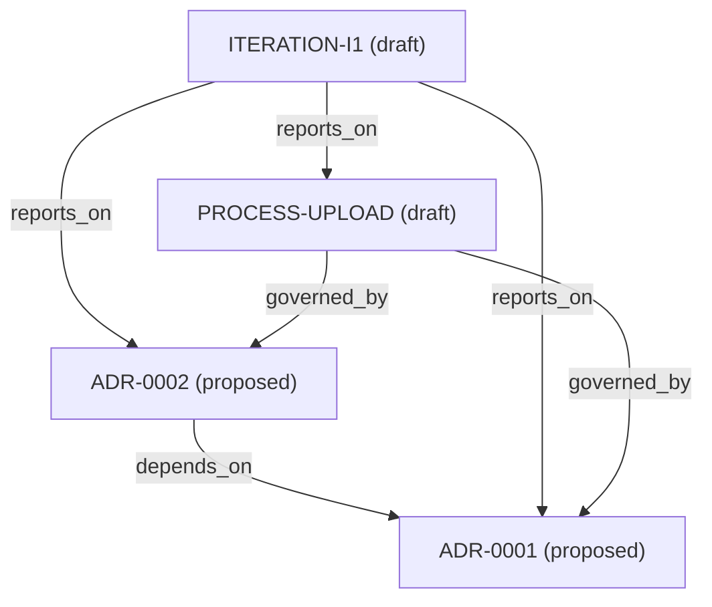

<!-- generated-by: knowledge_graph.py; do not edit -->

# Knowledge map

Generated from workspace metadata. Statuses describe records, not deployed behavior.

## Records

| Record | Title | Status | Owner |
| --- | --- | --- | --- |
| [ADR-0001](decisions/0001-retry-safe-upload.md) | ADR-0001 Retry-safe document upload | proposed | technical-owner |
| [ADR-0002](decisions/0002-atomic-upload-claim.md) | ADR-0002 Establish one owner for a concurrent upload attempt | proposed | technical-owner |
| [ITERATION-I1](iterations/I1.md) | Iteration I1 outcome report | draft | product-owner |
| [PROCESS-UPLOAD](knowledge/upload-retries.md) | Upload retry behavior | draft | technical-owner |

## Relationships

## Relationship links

| Record | Relation | Target |
| --- | --- | --- |
| [ADR-0002](decisions/0002-atomic-upload-claim.md) | depends_on | [ADR-0001](decisions/0001-retry-safe-upload.md) |
| [ITERATION-I1](iterations/I1.md) | reports_on | [ADR-0001](decisions/0001-retry-safe-upload.md) |
| [ITERATION-I1](iterations/I1.md) | reports_on | [ADR-0002](decisions/0002-atomic-upload-claim.md) |
| [ITERATION-I1](iterations/I1.md) | reports_on | [PROCESS-UPLOAD](knowledge/upload-retries.md) |
| [PROCESS-UPLOAD](knowledge/upload-retries.md) | governed_by | [ADR-0001](decisions/0001-retry-safe-upload.md) |
| [PROCESS-UPLOAD](knowledge/upload-retries.md) | governed_by | [ADR-0002](decisions/0002-atomic-upload-claim.md) |
